# Práctica Semana 8 — Automatización de despliegue Backend con Docker Compose, PostgreSQL y pgAdmin

## Automatización del despliegue de una aplicación backend utilizando Docker Compose

## Duración

120 minutos

---

# Fundamentos

Docker es una plataforma que permite crear, ejecutar y administrar contenedores. Los contenedores son entornos aislados que incluyen todas las dependencias necesarias para ejecutar una aplicación, garantizando compatibilidad entre diferentes sistemas operativos y facilitando el despliegue de software.

Docker Compose permite definir y administrar múltiples contenedores mediante un único archivo de configuración, facilitando la automatización del despliegue de aplicaciones compuestas por varios servicios.

En esta práctica se trabajó con una aplicación backend desarrollada en Spring Boot, una base de datos PostgreSQL y la herramienta pgAdmin para la administración de la base de datos. Además, se implementó una estrategia Multi-Stage Build para optimizar la construcción de imágenes Docker.

Se utilizaron los siguientes componentes:

- Spring Boot — Framework utilizado para desarrollar la aplicación backend.
- Docker — Plataforma de contenedorización.
- Docker Compose — Herramienta para orquestación de contenedores.
- PostgreSQL — Sistema gestor de bases de datos relacional.
- pgAdmin — Herramienta gráfica para administración de PostgreSQL.
- Maven — Herramienta para compilación y gestión de dependencias.
- Java 21 — Entorno de ejecución utilizado por la aplicación.
- Dockerfile Multi-Stage — Técnica para optimizar imágenes Docker.

---

# Conocimientos previos requeridos

- Comandos básicos de Linux.
- Uso básico de Docker y Docker Compose.
- Manejo de Git y GitHub.
- Conocimientos básicos de Spring Boot.
- Uso de terminal y navegador web.

---

# Objetivos

- Clonar el proyecto backend proporcionado.
- Configurar variables de entorno mediante archivo .env.
- Crear un Dockerfile para contenerizar la aplicación.
- Implementar una estrategia Multi-Stage Build.
- Configurar PostgreSQL y pgAdmin mediante Docker Compose.
- Crear redes y volúmenes para persistencia y conectividad.
- Construir la imagen Docker del backend.
- Desplegar todos los servicios mediante Docker Compose.
- Verificar la conectividad entre la aplicación y PostgreSQL.
- Acceder a pgAdmin para la administración de la base de datos.

---

# Equipo necesario

| Recurso | Detalle |
|----------|----------|
| Sistema Operativo | Kali Linux |
| Software | Docker y Docker Compose |
| Herramientas | Git, Nano y navegador web |
| Lenguaje | Java 21 |
| Base de Datos | PostgreSQL 16 |
| Conectividad | Acceso a Internet |

---

# Material de apoyo

- Documentación oficial de Docker
- Documentación oficial de Docker Compose
- Documentación oficial de PostgreSQL
- Documentación oficial de pgAdmin
- Documentación oficial de Spring Boot
- Guía de la asignatura

---

# Procedimiento

## Paso 1 — Clonación del proyecto

Se clonó el repositorio proporcionado para la práctica y posteriormente se ingresó al directorio principal del proyecto.

```bash
git clone https://github.com/maguaman2/tendencias-mar22-security.git

cd tendencias-mar22-security
```

Figura 1-1. Clonación del proyecto backend

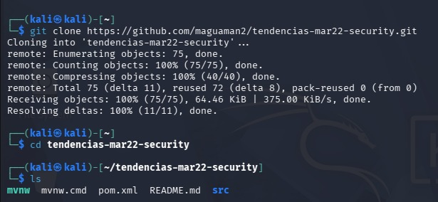

---

## Paso 2 — Configuración del archivo .env

Se creó el archivo `.env` para almacenar las variables de entorno utilizadas por PostgreSQL, pgAdmin y la aplicación backend.

```bash
nano .env

cat .env
```

Figura 1-2. Configuración del archivo .env

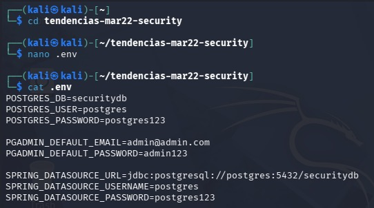

---

## Paso 3 — Creación del Dockerfile

Se creó el archivo Dockerfile para empaquetar la aplicación backend.

```bash
nano Dockerfile

cat Dockerfile
```

Figura 1-3. Creación del Dockerfile

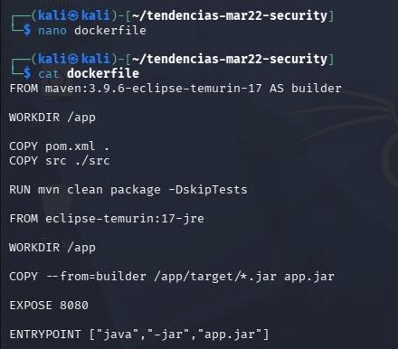

---

## Paso 4 — Configuración del Dockerfile Multi-Stage

Se configuró el Dockerfile utilizando Maven para la compilación y Java 21 para la ejecución de la aplicación.

```dockerfile
FROM maven:3.9.6-eclipse-temurin-21 AS builder

WORKDIR /app

COPY pom.xml .
COPY src ./src

RUN mvn clean package -DskipTests

FROM eclipse-temurin:21-jre

WORKDIR /app

COPY --from=builder /app/target/*.jar app.jar

EXPOSE 8080

ENTRYPOINT ["java","-jar","app.jar"]
```

### Explicación del Dockerfile

| Instrucción | Función |
|------------|----------|
| FROM maven | Entorno de compilación |
| WORKDIR | Directorio de trabajo |
| COPY | Copia archivos del proyecto |
| RUN mvn clean package | Genera el archivo JAR |
| FROM eclipse-temurin | Imagen optimizada para producción |
| COPY --from=builder | Copia el JAR compilado |
| EXPOSE 8080 | Expone el puerto de la aplicación |
| ENTRYPOINT | Ejecuta la aplicación |

Figura 1-4. Configuración del Dockerfile Multi-Stage

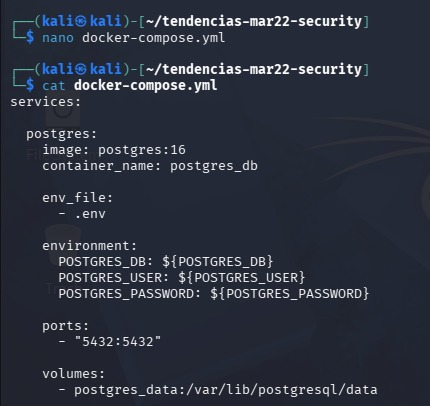

---

## Paso 5 — Creación del archivo docker-compose.yml

Se creó el archivo docker-compose.yml para administrar PostgreSQL, pgAdmin y la aplicación backend.

```bash
nano docker-compose.yml
```

Figura 1-5. Creación del archivo docker-compose.yml

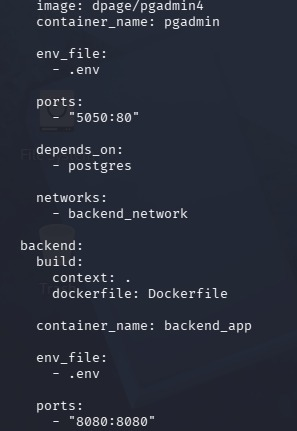

---

## Paso 6 — Configuración de Docker Compose

Se configuraron los servicios PostgreSQL, pgAdmin y backend, además de las redes y volúmenes necesarios para garantizar la persistencia de datos y la comunicación entre contenedores.

Figura 1-6. Configuración de Docker Compose


---

## Paso 7 — Construcción de la imagen Docker

Se construyó la imagen Docker correspondiente a la aplicación backend y posteriormente se verificaron las imágenes disponibles en el sistema.

```bash
docker compose build

docker images
```

Figura 1-7. Construcción de la imagen Docker

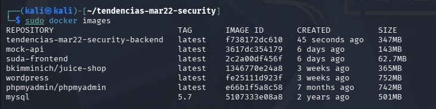

---

## Paso 8 — Despliegue de contenedores

Se levantaron todos los servicios definidos en Docker Compose y posteriormente se verificó el estado de los contenedores.

```bash
docker compose up -d

docker ps
```

Figura 1-8. Despliegue de contenedores

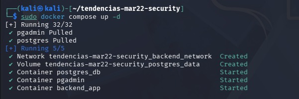

---

## Paso 9 — Verificación de volúmenes Docker

Se verificó la creación correcta de los volúmenes encargados de almacenar los datos de PostgreSQL.

```bash
docker volume ls
```

Figura 1-9. Verificación de volúmenes Docker

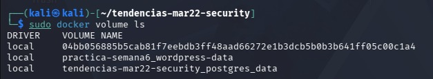

---

## Paso 10 — Verificación de redes Docker

Se verificó la creación de la red utilizada para la comunicación entre PostgreSQL, pgAdmin y la aplicación backend.

```bash
docker network ls
```

Figura 1-10. Verificación de redes Docker

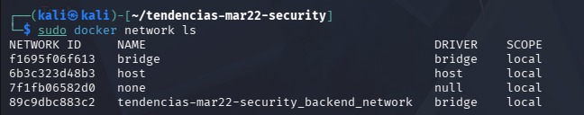

---

## Paso 11 — Verificación de conectividad entre Backend y PostgreSQL

Se revisaron los registros del contenedor backend para comprobar la conexión exitosa hacia PostgreSQL y la ejecución correcta de las migraciones de base de datos.

```bash
docker logs backend_app
```

Entre los mensajes observados se verificó:

```text
Database: jdbc:postgresql://postgres:5432/securitydb

HikariPool-1 - Added connection

Started SecurityApplicationKt
```

Figura 1-11. Verificación de conectividad entre Backend y PostgreSQL

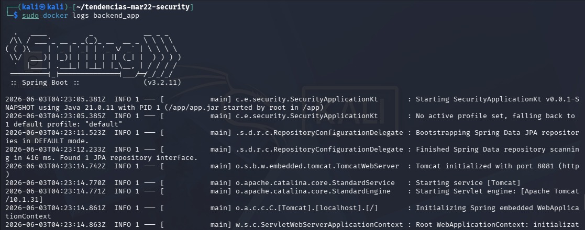

---

## Paso 12 — Acceso a pgAdmin

Se accedió al panel de administración pgAdmin desde el navegador web utilizando el puerto configurado.

```text
http://localhost:5050
```

Credenciales utilizadas:

```text
Usuario: admin@admin.com
Contraseña: admin123
```

Figura 1-12. Acceso a pgAdmin

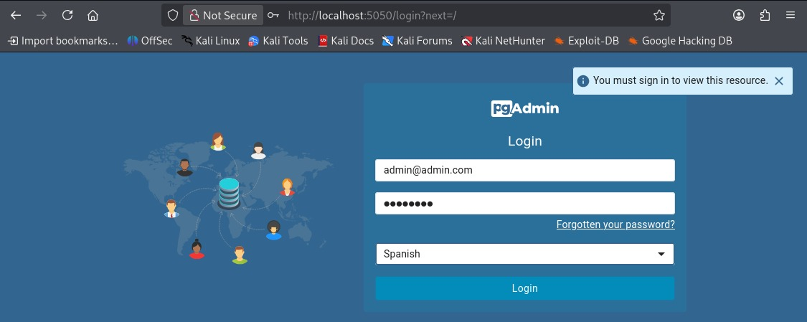

---

# Diagrama de contenedores y puertos

```text
┌──────────────────────────────────────────────┐
│                 Docker Engine                │
│                                              │
│  ┌────────────────────────────────────────┐  │
│  │             PostgreSQL                 │  │
│  │               :5432                    │  │
│  └─────────────────┬──────────────────────┘  │
│                    │                         │
│                    ▼                         │
│  ┌────────────────────────────────────────┐  │
│  │        Backend Spring Boot             │  │
│  │              :8080                     │  │
│  └────────────────────────────────────────┘  │
│                                              │
│  ┌────────────────────────────────────────┐  │
│  │              pgAdmin                   │  │
│  │               :5050                    │  │
│  └────────────────────────────────────────┘  │
└──────────────────────────────────────────────┘
```

---

# Acceso desde navegador

## pgAdmin

```text
http://localhost:5050
```

---

# Resultados esperados

Se automatizó correctamente el despliegue de una aplicación backend mediante Docker Compose. Se configuró una base de datos PostgreSQL junto con pgAdmin para su administración, utilizando redes y volúmenes para garantizar la persistencia y conectividad entre servicios. Además, se implementó una estrategia Multi-Stage Build para optimizar la imagen Docker de la aplicación. Finalmente, se verificó la conectividad entre la aplicación backend y PostgreSQL mediante los registros del contenedor y el acceso al panel pgAdmin.

---

# Bibliografía

Docker Inc. (2026). Docker Documentation.

https://docs.docker.com/

Docker Inc. (2026). Docker Compose Documentation.

https://docs.docker.com/compose/

The PostgreSQL Global Development Group. (2026). PostgreSQL Documentation.

https://www.postgresql.org/docs/

pgAdmin Development Team. (2026). pgAdmin 4 Documentation.

https://www.pgadmin.org/docs/

VMware Tanzu. (2026). Spring Boot Reference Documentation.

https://docs.spring.io/spring-boot/docs/current/reference/html/

Apache Software Foundation. (2026). Apache Maven Documentation.

https://maven.apache.org/guides/

## Repositorio utilizado

https://github.com/maguaman2/tendencias-mar22-security
